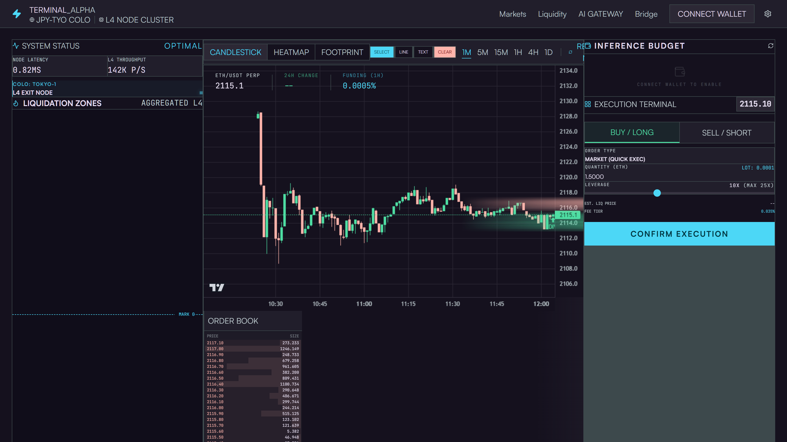
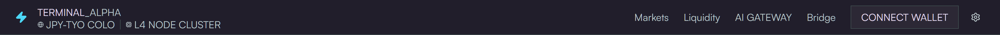

# Walkthrough: Reviewing a Real Production App

This is a live audit of **HyperMap** — a Hyperliquid trading terminal built with React 19, Tailwind v4, and lightweight-charts v5. The codebase has a mature design system documented in `docs/DESIGN.md` ("Institutional Terminal Alpha"). We'll run fe-engineer against it from scratch.

---

## The app



*Cockpit-dense. Every panel filled. Mark price, candlestick chart, order book, execution terminal, AI inference budget — all above the fold.*



*Header: node latency, colo location, nav, wallet connect. Sharp corners, monospace data, uppercase labels.*

---

## Step 1 — Generate tokens from DESIGN.md

HyperMap has a `docs/DESIGN.md` with color tables and design rules but no standalone `tokens.css`. Start by extracting machine-readable tokens from the doc:

```
mcp__fe-engineer__generate_tokens({
  designFile: "docs/DESIGN.md",
  cwd: "/path/to/HyperMap"
})
```

The tool parses the markdown tables — including the explicit `CSS Variable` column in the surface table and the inferred `bg-*` / `text-*` / `border-*` names in the others — and writes `docs/tokens.css`:

```
{
  "writtenTo": "docs/tokens.css",
  "colorCount": 19,
  "spacingCount": 0,
  "totalTokens": 19,
  "warnings": []
}
```

The generated file:

```css
/**
 * Design Tokens — generated from DESIGN.md
 * Tool: fe-engineer › generate_tokens
 */

:root {

  /* ── Color Tokens ──────────────────────────────────── */

  --color-surface:                    #15111e;   /* Primary canvas — outermost background */
  --color-surface-dim:                #15111e;   /* Dim variant (same as surface) */
  --color-surface-bright:             #3b3745;   /* Bright surface for hover highlights */
  --color-surface-container-lowest:   #0f0c19;   /* Deepest inset — textarea, log wells */
  --color-surface-container-low:      #1d1a27;   /* Subtle inset */
  --color-surface-container:          #211e2b;   /* Standard panel background */
  --color-surface-container-high:     #2c2835;   /* Elevated panel */
  --color-surface-container-highest:  #373341;   /* Topmost layer — dropdowns, modals */
  --color-on-surface:                 #e7dff2;   /* Primary text */
  --color-on-surface-variant:         #bcc9cd;   /* Muted / secondary text */
  --color-outline:                    #869397;   /* Visible borders */
  --color-outline-variant:            #3d494c;   /* Divider lines */
  --color-primary:                    #4cd7f6;   /* Cyan — active, interactive, CTA */
  --color-on-primary:                 #003640;
  --color-secondary:                  #4edea3;   /* Green — long, positive, profit */
  --color-tertiary:                   #ffb873;   /* Orange — attention, warning */
  --color-error:                      #ffb4ab;   /* Rose — short, negative, loss */
  --color-background:                 #15111e;
}
```

Now we have a token set. Any hardcoded hex in component code that doesn't appear here is a violation.

---

## Step 2 — Full audit, all 13 components

```
mcp__fe-engineer__review_file({
  filePath: "src/components/AIGatewayPicker.tsx",
  designFile: "docs/tokens.css",
  cwd: "/path/to/HyperMap"
})
```

Run across all 14 files (13 components + App.tsx). Summary:

| File | Lint | A11y | Design |
|------|------|------|--------|
| `TradingChart.tsx` | **61 errors** | 1 warning | 3 warnings |
| `TopUpModal.tsx` | **8 errors** | 1 error, 1 warning | — |
| `AIInsights.tsx` | **8 errors** | 1 error | 2 warnings |
| `PaymentTopUp.tsx` | **7 errors** | 2 errors | — |
| `AIGatewayPicker.tsx` | — | **4 errors** | 1 warning |
| `BalanceWidget.tsx` | 2 errors | — | 1 warning |
| `LiquidityHeatmap.tsx` | 1 error | — | 1 warning |
| `App.tsx` | — | — | 1 warning |
| `TradeTicket.tsx` | — | — | 1 warning |
| `PositionPanel.tsx` | — | — | — |
| `ModelInfoTooltip.tsx` | — | — | — |
| `Header.tsx` | ✓ clean | ✓ clean | ✓ clean |
| `WalletConnect.tsx` | ✓ clean | ✓ clean | ✓ clean |

---

## What the findings look like

### AIGatewayPicker — 4 unlabelled buttons

The picker has icon-only controls — close, expand, select, configure — with no accessible names. Each fires a `WCAG 4.1.2` error:

```json
{
  "element": "<button>",
  "line": 178,
  "issue": "button-icon-only",
  "severity": "error",
  "detail": "Button appears to have no accessible name. Add aria-label or visible text.",
  "wcag": "4.1.2"
}
```

The fix is one attribute per button:
```jsx
// before
<button onClick={onClose}><XIcon /></button>

// after
<button onClick={onClose} aria-label="Close AI gateway picker"><XIcon /></button>
```

### TopUpModal — semantic HTML and keyboard access

The modal backdrop is a `<div onClick>` with no `role`:

```json
{
  "element": "<div>",
  "line": 50,
  "issue": "interactive-no-role",
  "severity": "error",
  "detail": "<div onClick> has no role. Add role=\"button\" or use <dialog>.",
  "wcag": "4.1.2"
}
```

Biome is already telling you the fix — `lint/a11y/useSemanticElements` suggests converting the whole modal to `<dialog>`, which also resolves the `aria-modal` complaint (that attribute is only valid on `role="dialog"` elements, not bare `<div>`s).

The SVG close icon (line 69) additionally needs `aria-hidden="true"` since it's decorative.

### TradingChart — 61 lint errors, all `any`

The chart is the app's most complex component at 584 lines. Every Lightweight Charts v5 callback and series config is typed as `any`:

```
[error] lint/suspicious/noExplicitAny — Unexpected any. Specify a different type.
```

61 occurrences. The lightweight-charts v5 package ships full TypeScript types — `IChartApi`, `ISeriesApi<'Candlestick'>`, `CandlestickData`, `MouseEventParams`. Replacing `any` here eliminates the lint bill and catches real bugs (wrong field names on series data, incompatible config keys).

### AIInsights — string concatenation + deep ternaries

```
[error] lint/style/useTemplate — Template literals are preferred over string concatenation.
```

Two deep ternaries in JSX (depth ≥ 2) that should be extracted to variables:

```jsx
// before — hard to read, flags lint/design both
{isLoading ? spinner : hasData ? <Chart /> : <Empty />}

// after
const content = isLoading ? spinner : hasData ? <Chart /> : <Empty />;
return <div>{content}</div>;
```

### PaymentTopUp — unlabelled amount input

```json
{
  "element": "<input type=\"number\">",
  "line": 96,
  "issue": "input-no-label",
  "severity": "error",
  "detail": "Input has no aria-label or aria-labelledby.",
  "wcag": "1.3.1"
}
```

The amount field has no label — screen readers announce it as "number field" with no context. Fix: add `aria-label="Top-up amount in USDC"` or pair with a `<label htmlFor>`.

---

## Step 3 — Design-aware scan in action

With `tokens.css` loaded, the design scanner cross-references hardcoded values against your token set. The `TradingChart.tsx` inline styles on lines 519, 547, 563 flag as:

```json
{
  "issue": "inline-style",
  "severity": "warning",
  "detail": "<div> uses an inline style prop.",
  "suggestion": "Move styles to a CSS class or design token. Inline styles bypass your design system and can't be overridden by themes."
}
```

Any `#hex` value found in a style prop that's *not* in `tokens.css` escalates to `hardcoded-color`. In this codebase the chart component is the only sanctioned location for hardcoded hex (lightweight-charts can't read CSS variables) — and the values there correctly match the token set, so no violations surface.

---

## Step 4 — If you start with only a DESIGN.md

Most projects don't have a tokens file yet. The workflow:

```
# 1. Generate tokens from your design doc
mcp__fe-engineer__generate_tokens({
  designFile: "docs/DESIGN.md",
  cwd: "/path/to/project"
})
# → writes docs/tokens.css

# 2. Review a component with the token context
mcp__fe-engineer__review_file({
  filePath: "src/components/MyComponent.tsx",
  designFile: "docs/tokens.css",
  cwd: "/path/to/project"
})
```

`generate_tokens` handles three table formats:

| Format | Example |
|--------|---------|
| Explicit CSS variable column | `\| bg-surface \| --color-surface \| #15111e \| ...` |
| Tailwind class + hex (inferred) | `\| text-on-surface \| #e7dff2 \| Primary text \|` |
| Combined classes + hex | `\| border-outline / bg-outline \| #869397 \| Borders \|` |

It also scans CSS code blocks inside the doc for `--var: value;` declarations.

---

## What's clean out of the box

`Header.tsx` and `WalletConnect.tsx` passed every check — lint, a11y, design. Both use semantic HTML, proper button labelling, no inline styles, and no hardcoded values. They're the reference implementation for the rest of the codebase.

`Header.tsx` in particular is worth reading if you're about to write a new component — it's what the DESIGN.md component patterns look like in practice.
