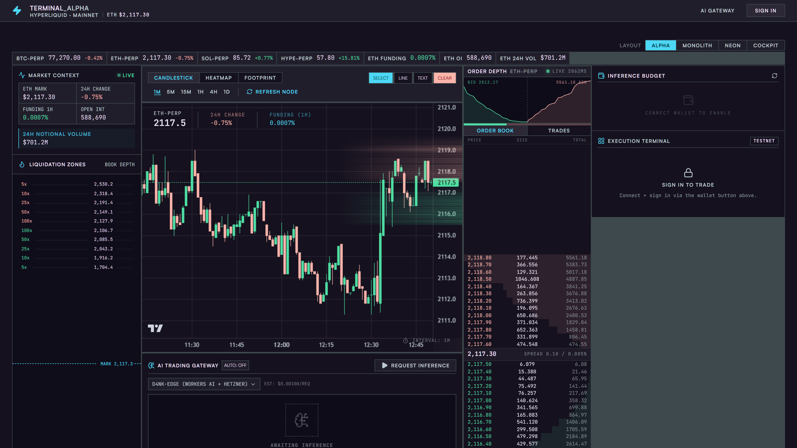
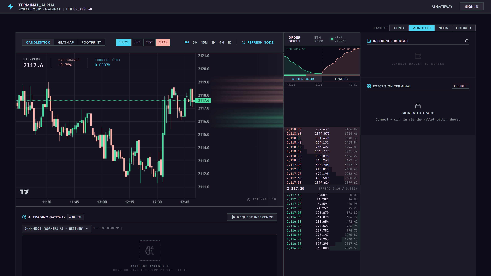
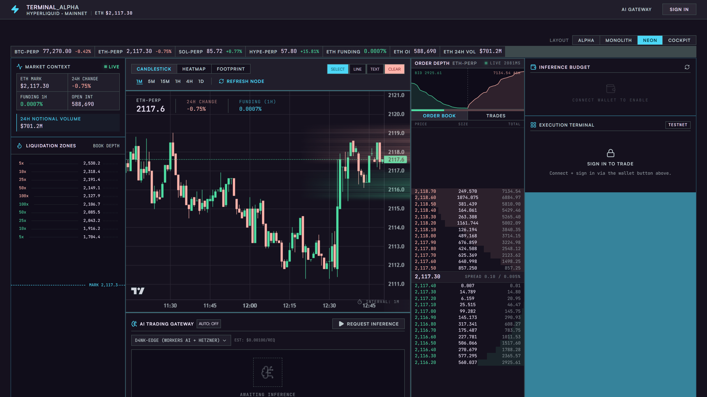
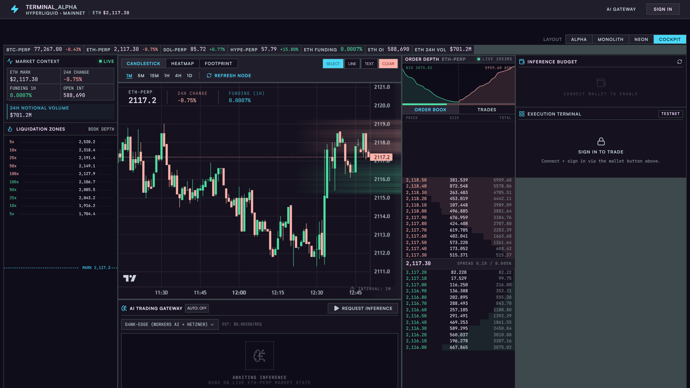
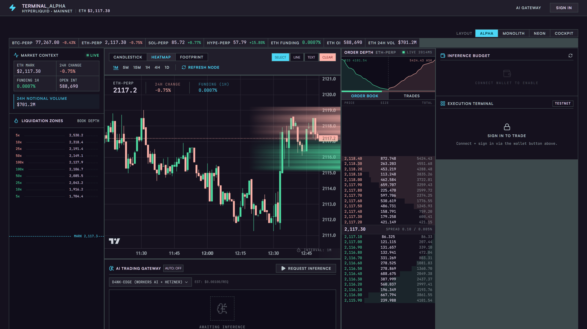
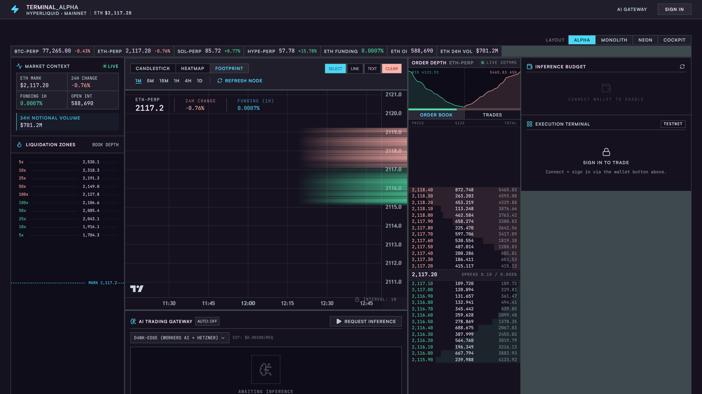
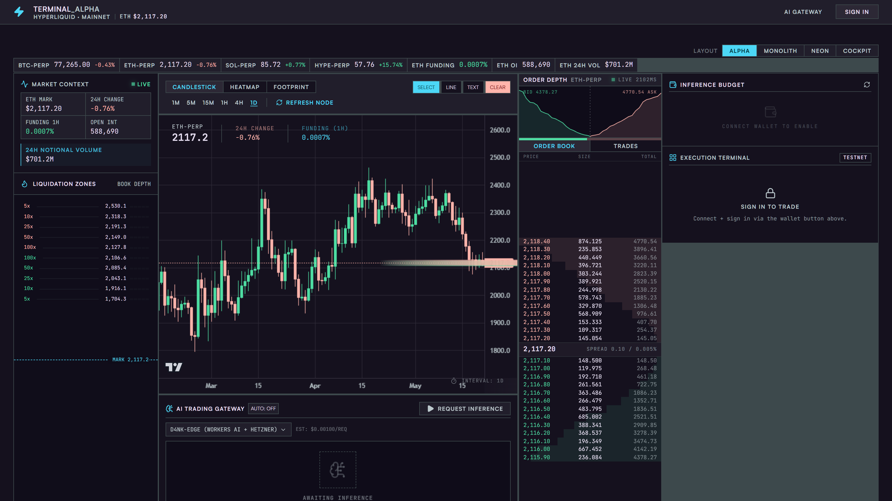
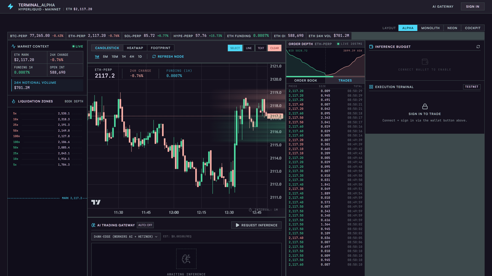

# Walkthrough: Auditing a Real Trading Terminal

This is a live audit of **HyperMap** — a Hyperliquid perpetuals terminal built with React 19, Tailwind v4, and lightweight-charts v5. It has four layout modes, three chart types, and a real-time order book. We'll audit the whole component surface using fe-engineer before shipping.

---

## The app

HyperMap runs at `localhost:3000` (Express + Vite). Four layout modes selectable from the top-right toolbar.

### ALPHA — default, full-density cockpit



*Mark price, liquidation zones, candlestick chart, order depth, order book, AI inference panel, execution terminal — all visible simultaneously. Every pixel earns its place.*

### MONOLITH — chart-dominant



*Chart takes full centre width. Order book compressed to the right edge. Suits single-monitor setups focused on price action.*

### NEON — cyan accent variant



*Same density as ALPHA, cyan highlight on the active right column. The primary token (`#4cd7f6`) used as a structural accent.*

### COCKPIT — maximum data density



*Narrower gutters, more rows visible in the order book and liquidation zones. Built for 4K or ultrawide.*

---

## Chart type and timeframe controls

Three chart modes, six timeframes — all switchable without a page reload.

### HEATMAP — order flow concentration



*Liquidity heatmap overlay on the price chart. Volume clusters rendered as `rgba(78, 222, 163, α)` (secondary token) — the design system's sanctioned canvas colour.*

### FOOTPRINT — volume-at-price bars



*Each bar broken into bid/ask volume at price. Long green strips = absorption. The colour values here must match design tokens exactly — a common source of drift.*

### Daily chart (1D timeframe)



*Monthly candles visible. Same component, same code — the timeframe selector just changes the data slice fed to lightweight-charts.*

### TRADES tab



*Switches the bottom-right panel from ORDER BOOK depth to live trade stream. The tab toggle is a pair of `<button>` elements — prime candidates for the UI wiring audit.*

---

## Running the audit

### Step 1 — Generate tokens from DESIGN.md

HyperMap has a mature design system in `docs/DESIGN.md` ("Institutional Terminal Alpha") but no standalone token file. Start there:

```
mcp__fe-engineer__generate_tokens({
  designFile: "docs/DESIGN.md",
  cwd: "/path/to/HyperMap"
})
```

The tool scans every markdown table for hex values and CSS variable names, handles combined Tailwind class cells like `` `border-outline` / `bg-outline` ``, and writes `docs/tokens.css`:

```
{
  "writtenTo": "docs/tokens.css",
  "colorCount": 19,
  "totalTokens": 19,
  "warnings": []
}
```

Generated output (excerpt):

```css
:root {
  --color-surface:                    #15111e;   /* Primary canvas */
  --color-primary:                    #4cd7f6;   /* Cyan — active, CTA */
  --color-secondary:                  #4edea3;   /* Green — long, profit */
  --color-error:                      #ffb4ab;   /* Rose — short, loss */
  --color-outline-variant:            #3d494c;   /* Divider lines */
  /* ... 14 more */
}
```

Now any hardcoded hex in component code that doesn't appear in this set is a design system violation.

---

### Step 2 — Audit the full component surface

Run `review_file` across all 13 components with the token context:

```
mcp__fe-engineer__review_file({
  filePath: "src/components/TradingChart.tsx",
  designFile: "docs/tokens.css",
  cwd: "/path/to/HyperMap"
})
```

Results across the whole surface:

| Component | What it renders | Lint | A11y | Design |
|-----------|----------------|------|------|--------|
| `TradingChart.tsx` | Candlestick/heatmap/footprint chart | **61 errors** | 1 warn | 3 warn |
| `TopUpModal.tsx` | Payment top-up overlay | **8 errors** | 1 error, 1 warn | — |
| `AIInsights.tsx` | AI inference panel | **8 errors** | 1 error | 2 warn |
| `PaymentTopUp.tsx` | Top-up form | **7 errors** | 2 errors | — |
| `AIGatewayPicker.tsx` | Gateway selector dropdown | — | **4 errors** | 1 warn |
| `BalanceWidget.tsx` | Market context sidebar | 2 errors | — | 1 warn |
| `LiquidityHeatmap.tsx` | Heatmap canvas overlay | 1 error | — | 1 warn |
| `App.tsx` | Root layout + layout switcher | — | — | 1 warn |
| `TradeTicket.tsx` | Execution terminal | — | — | 1 warn |
| `PositionPanel.tsx` | Positions list | — | — | — |
| `ModelInfoTooltip.tsx` | Model info hover | — | — | — |
| `Header.tsx` | Top navigation bar | ✓ | ✓ | ✓ |
| `WalletConnect.tsx` | Wallet button | ✓ | ✓ | ✓ |

---

## What the findings mean in context

### TradingChart — 61 lint errors

The chart drives every view you saw above — candlestick, heatmap, footprint. All 61 errors are `noExplicitAny`:

```
[error] lint/suspicious/noExplicitAny — Unexpected any. Specify a different type.
```

lightweight-charts v5 ships full TypeScript types: `IChartApi`, `ISeriesApi<'Candlestick'>`, `CandlestickData`, `MouseEventParams`. Replacing `any` here catches real bugs — wrong field names on series updates, incompatible config keys passed to `createChart()` — not just cosmetic noise.

The one a11y warning: the inline SVG watermark (line 497) needs `aria-hidden="true"` since it's purely decorative.

The three design warnings are inline `style` props on `<div>` elements used for the chart container sizing (lines 519, 547, 563). These bypass the design system and can't be overridden by layout modes. The fix is CSS classes with the container dimensions.

### AIGatewayPicker — 4 unlabelled buttons

The gateway picker (triggered by the **AI GATEWAY** button in the header) has four icon-only controls with no accessible names — each fires `WCAG 4.1.2`:

```json
{ "element": "<button>", "line": 178, "issue": "button-icon-only",
  "detail": "Button appears to have no accessible name. Add aria-label or visible text.",
  "wcag": "4.1.2" }
```

Same error on lines 218, 247, 273. One attribute each:

```jsx
// before
<button onClick={onClose}><XIcon /></button>

// after
<button onClick={onClose} aria-label="Close gateway picker"><XIcon /></button>
```

### TopUpModal — use `<dialog>`, not a div

The modal backdrop is a `<div onClick>` with `role="dialog"` and `aria-modal` set on it:

```
[error] lint/nursery/useAriaPropsSupportedByRole
  — aria-modal is not supported by this element
[error] lint/a11y/useSemanticElements
  — Elements with role="dialog" can be changed to <dialog>
[error] lint/a11y/useKeyWithClickEvents
  — onClick without onKeyUp/onKeyDown
```

The native `<dialog>` element handles all of this: focus trapping, `aria-modal`, `Escape` to close, scroll locking. Converting `<div role="dialog">` to `<dialog>` resolves six of the eight lint errors in one change.

### PaymentTopUp — unlabelled amount input

The amount field (line 96) has no label:

```json
{ "element": "<input type=\"number\">", "line": 96,
  "issue": "input-no-label", "severity": "error",
  "detail": "Input has no aria-label or aria-labelledby.",
  "wcag": "1.3.1" }
```

Screen readers announce it as "number field" — no context. Fix: `aria-label="Top-up amount in USDC"`.

### AIInsights — deep ternaries in the AI panel

Two nested ternaries at depth ≥ 2 in the inference output panel (lines 192, 230):

```json
{ "issue": "deep-ternary", "severity": "warning",
  "detail": "JSX contains a 2-level nested ternary — hard to read and maintain." }
```

```jsx
// before
{isLoading ? <Spinner /> : hasData ? <Chart data={data} /> : <Empty />}

// after
const content = isLoading ? <Spinner /> : hasData ? <Chart data={data} /> : <Empty />;
return <div>{content}</div>;
```

### BalanceWidget — exhaustive deps

```
[error] lint/correctness/useExhaustiveDependencies
  — This hook does not specify all of its dependencies: refresh
[error] lint/correctness/useExhaustiveDependencies
  — This hook specifies more dependencies than necessary: userId, refreshTrigger
```

The market context sidebar (top-left in ALPHA/NEON/COCKPIT layouts) has a `useEffect` with a stale dependency array. This causes missed refreshes on node reconnect — a real bug, not just a lint nit.

---

## Design-aware scan in action

With `tokens.css` loaded the scanner cross-references hardcoded values against your token set. None of the chart canvas colours trigger violations because they correctly match the token hex values:

```js
// CORRECT — matches --color-secondary (#4edea3)
ctx.fillStyle = `rgba(78, 222, 163, ${alpha})`;

// CORRECT — matches --color-error (#ffb4ab)
ctx.fillStyle = `rgba(255, 180, 171, ${alpha})`;
```

DESIGN.md explicitly sanctions hardcoded hex in the chart config section (lightweight-charts can't read CSS variables). The scanner flags the inline `style` props on the chart wrapper divs, which are *not* sanctioned — those should use CSS classes.

---

## What clean looks like

`Header.tsx` and `WalletConnect.tsx` passed everything — lint, a11y, design. 

`Header.tsx` is the reference implementation: semantic HTML, every interactive element labelled, no inline styles, no hardcoded values. The layout switcher buttons (ALPHA / MONOLITH / NEON / COCKPIT) use the exact class strings from DESIGN.md §5 — `bg-primary text-on-primary` for active, `bg-surface-container text-on-surface-variant` for inactive.

If you're writing a new component, start by reading `Header.tsx`.

---

## Full workflow reference

```
# If you only have a design doc
mcp__fe-engineer__generate_tokens({
  designFile: "docs/DESIGN.md",
  cwd: "/path/to/project"
})

# Audit one file with design context
mcp__fe-engineer__review_file({
  filePath: "src/components/AIGatewayPicker.tsx",
  designFile: "docs/tokens.css",
  cwd: "/path/to/project"
})

# Audit without design context (generic rules only)
mcp__fe-engineer__review_file({
  filePath: "src/components/TopUpModal.tsx",
  cwd: "/path/to/project"
})

# Just accessibility
mcp__fe-engineer__audit_a11y({
  code: "<paste source here>",
  filePath: "PaymentTopUp.tsx"
})

# Just lint
mcp__fe-engineer__lint_fix({
  code: "<paste source here>",
  filePath: "TradingChart.tsx"
})
```
